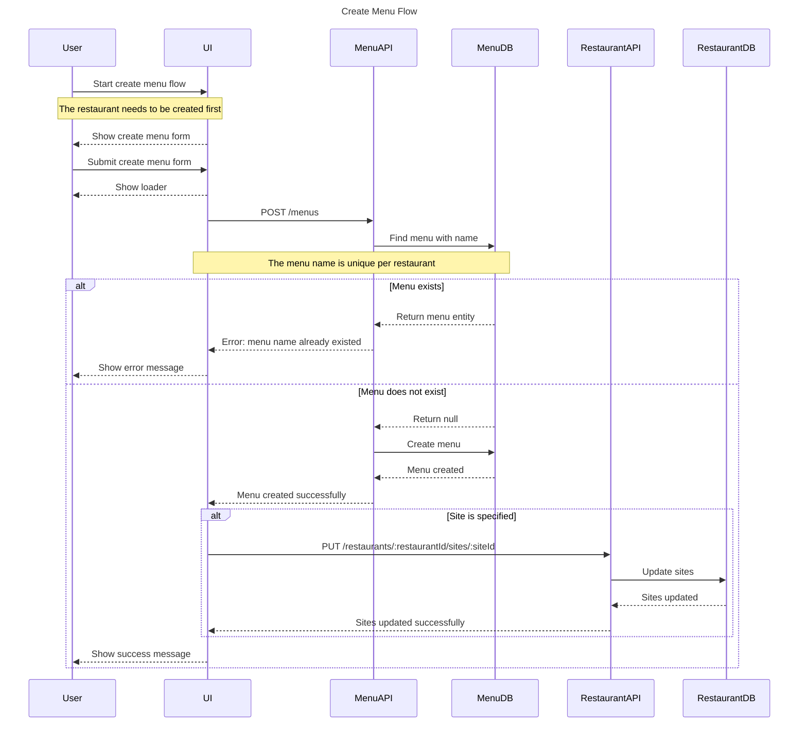
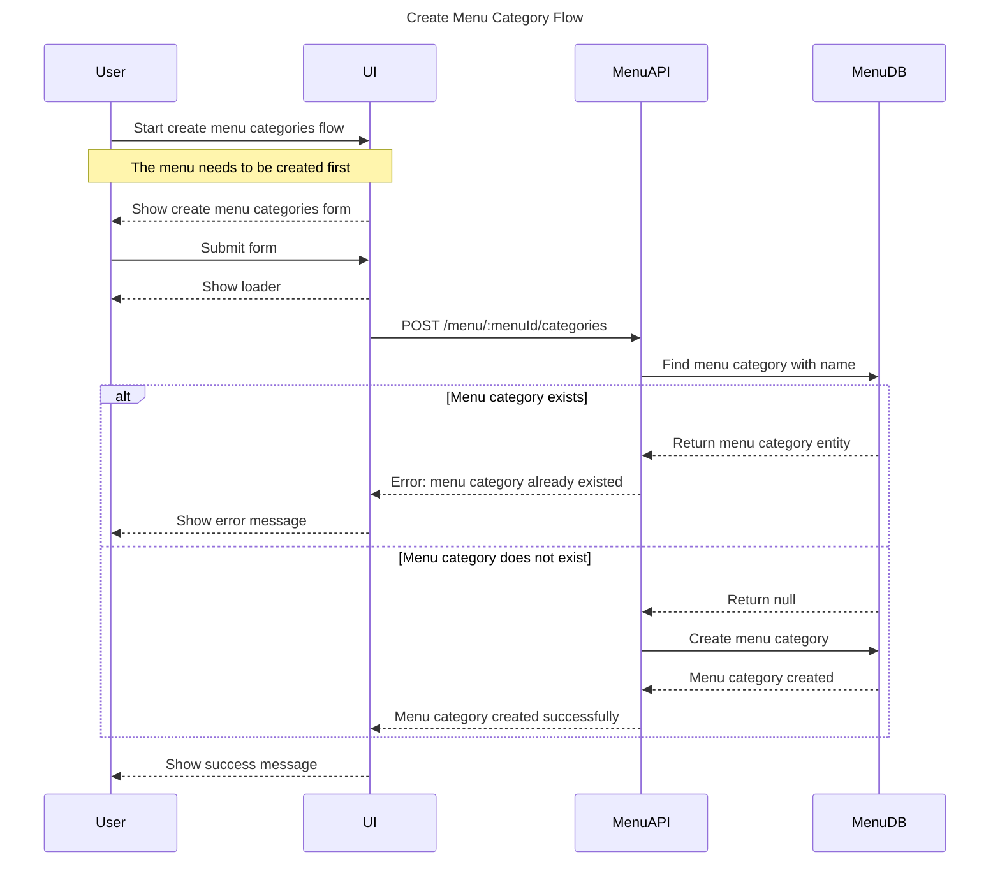
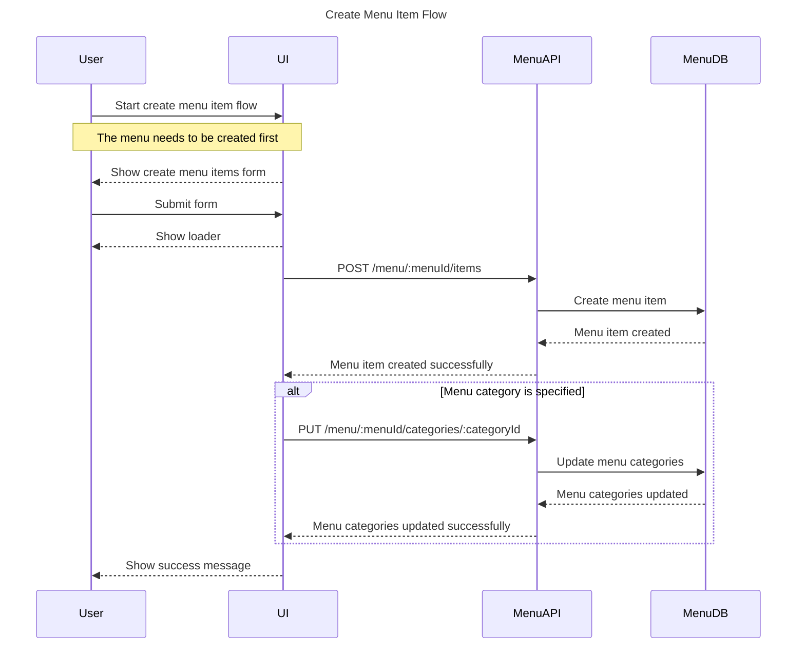

# Menu Flows

```mermaid
---
title: Create Menu Flow
---
sequenceDiagram
  participant User
  participant UI
  participant MenuAPI
  participant MenuDB
  participant RestaurantAPI
  participant RestaurantDB

  User ->> UI: Start create menu flow
  Note over User, UI: The restaurant needs to be created first
  UI -->> User: Show create menu form
  User ->> UI: Submit create menu form
  UI -->> User: Show loader
  UI ->> MenuAPI: POST /menus
  MenuAPI ->> MenuDB: Find menu with name
  Note over UI, MenuDB: The menu name is unique per restaurant
  alt Menu exists
    MenuDB -->> MenuAPI: Return menu entity
    MenuAPI -->> UI: Error: menu name already existed
    UI -->> User: Show error message
  else Menu does not exist
    MenuDB -->> MenuAPI: Return null
    MenuAPI ->> MenuDB: Create menu
    MenuDB -->> MenuAPI: Menu created
    MenuAPI -->> UI: Menu created successfully
    alt Site is specified
      UI ->> RestaurantAPI: PUT /restaurants/:restaurantId/sites/:siteId
      RestaurantAPI ->> RestaurantDB: Update sites
      RestaurantDB -->> RestaurantAPI: Sites updated
      RestaurantAPI -->> UI: Sites updated successfully
    end
    UI -->> User: Show success message
  end
```

```mermaid
---
title: Create Menu Category Flow
---
sequenceDiagram
  participant User
  participant UI
  participant MenuAPI
  participant MenuDB

  User ->> UI: Start create menu categories flow
  Note over User, UI: The menu needs to be created first
  UI -->> User: Show create menu categories form
  User ->> UI: Submit form
  UI -->> User: Show loader
  UI ->> MenuAPI: POST /menu/:menuId/categories
  MenuAPI ->> MenuDB: Find menu category with name
  alt Menu category exists
    MenuDB -->> MenuAPI: Return menu category entity
    MenuAPI -->> UI: Error: menu category already existed
    UI -->> User: Show error message
  else Menu category does not exist
    MenuDB -->> MenuAPI: Return null
    MenuAPI ->> MenuDB: Create menu category
    MenuDB -->> MenuAPI: Menu category created
    MenuAPI -->> UI: Menu category created successfully
  end
  UI -->> User: Show success message
```

```mermaid
---
title: Create Menu Item Flow
---
sequenceDiagram
  participant User
  participant UI
  participant MenuAPI
  participant MenuDB

  User ->> UI: Start create menu item flow
  Note over User, UI: The menu needs to be created first
  UI -->> User: Show create menu items form
  User ->> UI: Submit form
  UI -->> User: Show loader
  UI ->> MenuAPI: POST /menu/:menuId/items
  MenuAPI ->> MenuDB: Create menu item
  MenuDB -->> MenuAPI: Menu item created
  MenuAPI -->> UI: Menu item created successfully
  alt Menu category is specified
    UI ->> MenuAPI: PUT /menu/:menuId/categories/:categoryId
    MenuAPI ->> MenuDB: Update menu categories
    MenuDB -->> MenuAPI: Menu categories updated
    MenuAPI -->> UI: Menu categories updated successfully
  end
  UI -->> User: Show success message
```
